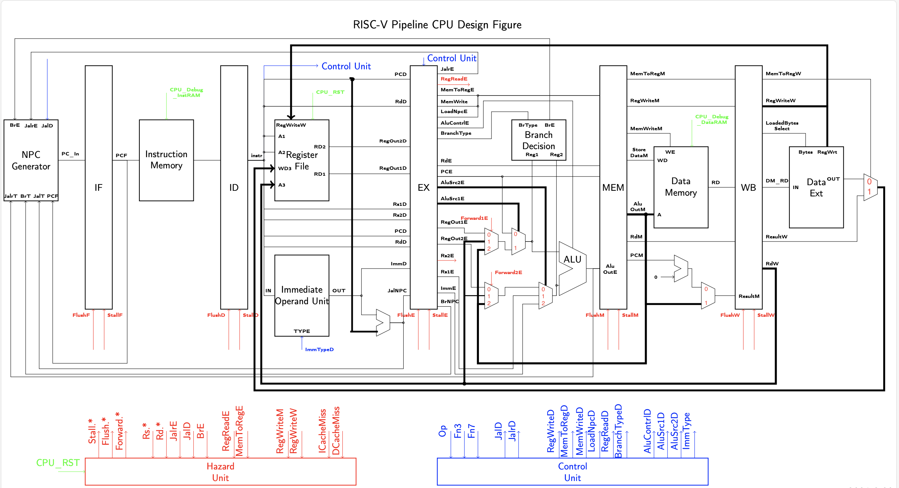

---

---

# CA Lab1 Report

PB18071463 朱映

[toc]

***

___注：表格中未提到的信号值全部为0___，使用已给的数据通路图，增加了一些标注。使用的指令类型和名字等出自RISC-V指令集手册。		

------

## 1. 描述执行一条XOR指令的过程

| 阶段 | 数据通路                                                     | 控制信号                                        |
| ---- | ------------------------------------------------------------ | ----------------------------------------------- |
| IF   | PC为XOR指令地址，从指令存储器传递XOR指令进入IF/ID寄存器；    |                                                 |
| ID   | 从IF/ID中得到Rs1和Rs2号，读出相应内容，送往ID/EX寄存器； 从IF/ID中得到Rd号，送往ID/EX寄存器； 从IF/ID中得到指令段，送往Control Unit控制单元产生控制信号； |                                                 |
| EX   | 从ID/EX中得到两个操作数内容，经过选择器进入ALU进行异或运算，结果存入EX/MEM； 从上一级获得控制信号并传入下一级； 从ID/EX中得到Rd号，送往EX/MEM寄存器； | ALUControlE = XOR（进行异或） ALUSrc1E = 1 |
| MEM  | 从上一级获得控制信号并传入下一级； 从EX/MEM中得到Rd号，送往MEM/WB寄存器； 从EX/MEM中得到ALU运算结果，送往MEM/WB寄存器； |                                                 |
| WB   | 从MEM/WB中得到ALU运算结果，送往寄存器堆； 从MEM/WB中得到Rd号，送往寄存器堆用于写回； | RegWriteW = 1                                   |

## 2. 描述执行一条BEQ指令的过程

| 阶段 | 数据通路                                                     | 控制信号                                                     |
| ---- | ------------------------------------------------------------ | ------------------------------------------------------------ |
| IF   | PC为BEQ指令地址，从指令存储器传递BEQ指令进入IF/ID寄存器；    |                                                              |
| ID   | 从IF/ID中得到Rs1和Rs2号，读出相应内容，送往ID/EX寄存器； 从IF/ID中得到immd立即数，经立即数处理单元处理后送往ID/EX寄存器； 从IF/ID中得到指令段，送往Control Unit控制单元产生控制信号； |                                                              |
| EX   | 从ID/EX中得到两个操作数内容，经过选择器进入分支决策单元判断是否分支，返回npc产生器； 从ID/EX中得到immd立即数，送回npc产生器； npc产生器根据上方信号和内容以及当前PC值产生下一个PC信号； | AluSrc1E = 1； BrType = BEQ; BrE = if Branch then 1 else 0 |

## 3.描述执行一条LHU指令的过程

| 阶段 | 数据通路                                                     | 控制信号                                                     |
| ---- | ------------------------------------------------------------ | ------------------------------------------------------------ |
| IF   | PC为LHU指令地址，从指令存储器传递LHU指令进入IF/ID寄存器；    |                                                              |
| ID   | 从IF/ID中得到Rs1号，读出相应内容，送往ID/EX寄存器； 从IF/ID中得到Rd号，送往ID/EX寄存器； 从IF/ID中得到指令段，送往Control Unit控制单元产生控制信号； 从IF/ID中得到immd立即数，经立即数处理单元处理后送往ID/EX寄存器； |                                                              |
| EX   | 从ID/EX中得到Rs1和immd立即数两个操作数内容，经过选择器进入ALU进行加法运算，结果存入EX/MEM； 从上一级获得控制信号并传入下一级； 从ID/EX中得到Rd号，送往EX/MEM寄存器； | ALUControlE =ADD（进行加法）； ALUSrc1E = 1； ALUSrc2E = 2 |
| MEM  | 从上一级获得控制信号并传入下一级； 从EX/MEM中得到Rd号，送往MEM/WB寄存器； 从EX/MEM中得到ALU运算结果，送往数据存储器取出对应地址内容，内容送往MEM/WB寄存器； |                                                              |
| WB   | 从MEM/WB中得到存储器内容，送往DataExt数据扩展单元扩展后送往寄存器堆； 从MEM/WB中得到Rd号，送往寄存器堆用于写回上方内容； | RegWriteW = 1； LoadedBytesSelect=2;                    |

## 4. 如果要实现CSR指令，设计图中还需要增加什么部件和数据通路?

- IF:  无需更改；
- ID:
  - 寄存器堆：添加 CSR 寄存器文件；读出Rd2之处增加选择器，可以选择CSR扩展后数据或者普通寄存器数据；
  - 立即数操作单元：增加扩展 CSR 数据功能；
  - 控制单元：生成 CSR 读写使能信号;
  - 段寄存器：完成对 CSR 数据扩展的格式支持；将符号扩展后的 CSR 、CSR地址、CSR控制信号送入 ID/EX 段寄存器;
- EX:
  - 在 ALUOp2 数据选择器处加入 CSR使得可以进行运算，运算结果送入 EX/MEM 段寄存器;
  - 段寄存器：将符号扩展后的 CSR 、CSR地址、CSR控制信号送入 EX/MEM 段寄存器;
- MEM:
  - 段寄存器：上一步存储在EX/MEM 段寄存器中运算结果送入 MEM/WB；将符号扩展后的 CSR 、CSR地址、CSR控制信号送入 MEM/WB 段寄存器;
- WB:
  - 段寄存器：CSR地址和控制信号送回寄存器堆；多路选择器增加 CSR 内容送回寄存器通路。

## 5. Verilog如何实现立即数的扩展?

- **I-Type**:  立即数第12位扩展

  `assign immd = {{20{Inst[31]}}, Inst[31:20]};`

- **S-Type**: 分开的立即数合并后扩展第12位

  `assign immd = {{20{Inst[31]}}, Inst[31:25], Inst[11:7]};`

- **SB-Type**: 分开的立即数合并后扩展第12位

  `assign immd = {{20{Inst[31]}}, Inst[7], Inst[30:25], Inst[11:8]};`

- **U-Type**: 立即数后方补0

  `assign immd = {Inst[31:12], 12'b0};`

- **UJ-Type**: 立即数合并后扩展第31位，最后补0

  `assign immd = {{12{Inst[31]}}, Inst[19:12], Inst[20], Inst[30:25],Inst[24:21]，1'b0};`

## 6. 如何实现 Data Memory 的非字对齐的Load和Store? 

在 Data Memory 使用字节交叉编址，将字节地址 mod 4 后按余数映射到4个存储体，从而达到选择不同的存储体进行load和store操作的目的。

## 7. ALU模块中，默认wire变量是有符号数还是无符号数?

无符号数。有无符号会根据ALU外的模块实现来进行判断，ALU并不需要做这样的判断。

## 8. 简述BranchE信号的作用

在EX阶段的Branch Decision模块进行branch判断后，如果判断不需要分支，则信号为0，不分支；若需要分支，则此信号为1，控制npc generator选择分支地址，从而实现跳转。

## 9. NPC Generator中对于不同跳转 target 的选择有没有优先级?

有。branch, Jalr > Jal （因为通常情况下EX 段指令靠前，所以跳转时EX段跳转指令优先）。

## 10. Harzard模块中，有哪几类冲突需要插入气泡，分别使流水线停顿几个周期?

有两类。

Load - Use型的 RAW 数据相关需要等待写入寄存器，因此插入一个气泡，停顿一个周期。 

分支和跳转的控制相关。分支操作在EX段，插入两个气泡，停顿两个周期；相对的，跳转需要停顿一个周期。

## 11. Harzard模块中采用静态分支预测器，遇到 branch 指令时，如何控制 flush 和 stall 信号?

Branch指令在EX段判断。如果发生分支，则需要Flush  IF/ID和ID/EX段寄存器来保证数据不被后方指令错误使用。否则不需要flush或stall。

## 12. 0号寄存器的值始终为0，是否会对forward的处理产生影响?

可能会。在RISC-V中有诸如JAL之类的指令，会在不需要rd的时候将rd设置为x0寄存器。如果这个结果被后方使用则很可能导致错误。所以需要在转发控制信号的时候对源寄存器是 x0 的情况进行判断，当出现某条指令写目标是 x0 寄存器时，直接传递0即可而非转发运算结果。
