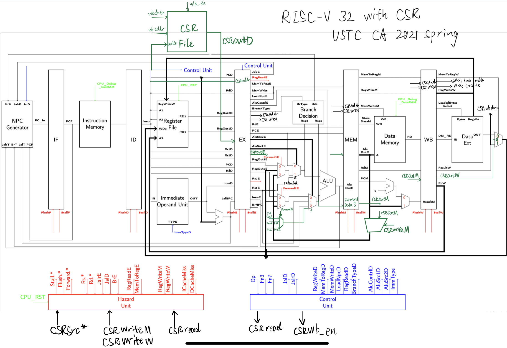

# 体系结构LAB 2实验报告

PB18071463 朱映

[toc]

## 实验目的

用verilog去实现 RV32I 流水线 CPU，添加 CSR 指令支持并在行为级仿真中通过测试样例

## 实验环境

-   Windows 10
-   MacBook Pro 2018 13‘
-   Vivado 2018.2
-   vscode
-   vlab虚拟机

## 实验过程和内容

### 阶段一

由于阶段二要求在CPU基础上进一步实现冒险和转发，因此跳过阶段一直接实现阶段二。

### 阶段二

根据要求补全信号，包括段寄存器、数据存储器、控制单元、hazard unit等。并改正了部分给定信号的错误之处。以下是部分注意点：

#### hazard unit

转发信号生成时需要注意优先级问题。比如在下方例子中：

``` assembly
add x1, a0, b0
xor x1, c0, x1
sub x1, d0, x1
```

运行 sub 指令时，为 x1 转发恰当的值，应当使用的是 xor 指令的结果，因此 mem 段有更高的优先级。另外如果转发的寄存器地址是 x0 则不转发。在分支指令确定出现跳转时，需要将这条指令以前的所有指令 flush 掉，避免产生影响。因此需要 flush 前两个阶段的寄存器（正在运行branch的后两条指令）

#### control unit

定义了 Opcode 的本地参数变量，方便后续的使用。Branch 和 jump 信号等分开处理，减少一个大的Always里的代码量，方便处理和找错。

需要注意的是有些信号比如 MemWriteD 为0的情况较多，因此在 case 前进行统一赋值可以减少代码长度便于阅读。

### 阶段三

为了实现 CSR 指令，有几种不同的思路。

第一种：使用原有的通路，不增加 ALU。第二种：新增一个 ALU 专门处理 CSR 相关信号。

这里使用的是第一种。第一种又可以分为在 EX，MEM 或者 WB 阶段写回。在 EX 阶段写回不需要处理 CSR 指令的转发。但是这里实现的是在 WB 阶段写回。设计图如下方。

根据已有的数据通路，增加了以下部分：

ID 阶段，新增将地址送入 CSR 寄存器的线路，增加 CSR 寄存器堆，同时将 CSR 寄存器的地址和取出的值放入 EX 段寄存器中。

在 EX 段，新增一个额外的 MUX 处理转发，用以将CSR指令所需的操作数正确的送入 ALU，同时将 所需的数据写入 MEM寄存器。ALU 新增处理 CSR 指令的运算，控制单元生成 CSR 相关的控制信号和 ALU 的信号。hazard unit 中增加对 CSR 相关的转发。

在 MEM段，增加多选器处理 CSR 转发并传递 CSR 控制信号。在 WB 段，增加写回 CSR 寄存器堆的通路。 



## 实验总结

在本次实验中主要遇到以下问题：

1. 经常因为复制原有数据通路代码但是忘了修改信号导致频繁出错。
2. 没有仔细思考 CSR 的更简洁的通路，导致实现相对复杂。
3. 对于控制信号理解不够深刻，浪费大量时间。

实验中获得的收获：

1. 更加熟练运用 vivado 和 verilog 语言。
2. 进一步加强了对流水线 CPU 的理解，相比以往有了更深刻的认识。

实验花费时间：主要花费在找错误和分析转发上。具体实现时间由于有之前的 MIPS 经验反而相对较少。

## 实验改进意见

1. 有控制信号位数不匹配，希望能够修改。
2. 对于修改不够友好，框架相对固定。
3. 没有给 CSR 的测试集，每个人的测试都不相同。